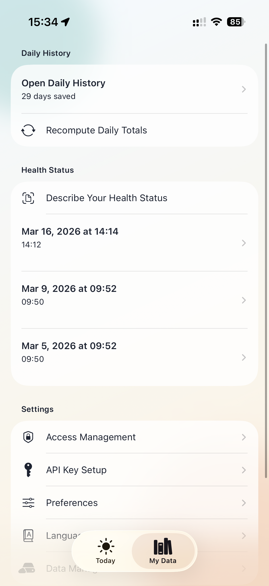
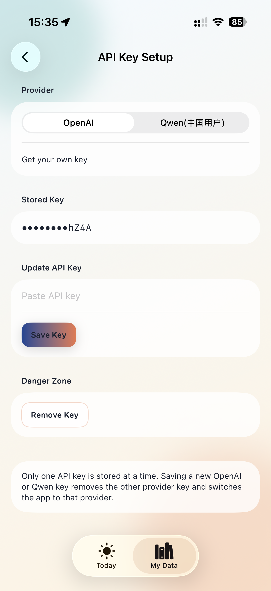

# Privacy-protected Calorie tracking and meal recommendation App

The key point of this app is that all data is stored and organized in your app/phone locally. You will need to apply your own API token from a LLM provider(Claude/OpenAI), but all the request's context (your health status/recent activities/meals) will be organized locally and then sent to the LLM provider. They claim that these API data won't be used for training their model and will be deleted one month later. So, if their claim is true, no one can see your data in theory. Besides, using your own token means the cost is very low; based on my experience, 3 meals a day cost about $0.004 /day.

As I’ve gotten older, losing weight has become more challenging. I often found myself second-guessing what I should or shouldn’t eat.

So I built this app to track both calories burned through daily activity and calories consumed through meals. The goal is to make it easy to see how much calorie “budget” I still have for the day — no more guessing or awkward uncertainty around food choices.

The app is designed to record activity, resting and active calorie burn, and meal intake. It also aims to provide smarter meal recommendations by considering recent activity, meals from the past two days, and health data such as body fat percentage.
Meal recommendation features are still in progress.

So far, it has helped me lose about 2 pounds in 3 weeks, and I hope it can be useful for others as well.

## ALL your data will be on your phone and in your GPT account only!

## UI Screenshots

### Progress And Trend View

This view highlights streak tracking and the recent estimated energy balance chart, giving users a quick read on logging consistency and daily calorie balance trends.

### Activity and meal Logging Dashboard

You only need to take a photo to record your meal. The LLM will analyze everything for you.

### Activity and meal Logging Dashboard

It combines a meal logging shortcut, one-shot next meal recommendation, and a live health snapshot for sleep, energy, exercise, steps, weight, and body fat.

### My Data Hub

The `My Data` tab centralizes daily history, health status entries, and settings such as access management, API key setup, language, and data management.

### API Key Setup

`API Key Setup` lets users switch between OpenAI and Qwen, save one provider key securely in Keychain, update the stored key, or remove it when needed. Chinese users can use the Qwen API. 中国用户推荐使用千问的api。

### Language Settings

The `Language` screen switches both the app UI text and AI response language between English and Simplified Chinese.

## Requirements
- Xcode 15+
- iOS 17+
- OpenAI or Qwen API key for AI features (entered at runtime, stored securely in Keychain)
- HealthKit and Location permissions are optional but recommended for richer recommendations

## Run
1. Open `What to Eat.xcodeproj` in Xcode.
2. Select the `What to Eat` scheme and an iOS 17+ simulator/device.
3. Build and run.
4. Complete onboarding:
   - Intro disclaimer
   - HealthKit permission (read-only)
   - Location permission (When In Use)
   - Photos permission
   - Enter an OpenAI or Qwen API key on `API Key Setup`

## Before Publishing
- Set your own Apple account in Xcode Signing & Capabilities.
- Replace the placeholder bundle identifiers (`com.example.whattoeat*`) with your own unique identifiers before archiving or App Store submission.

## API Key Handling
- The app never hardcodes any provider API key.
- API key is entered by user and stored in Keychain (`kSecAttrAccessibleWhenUnlockedThisDeviceOnly`).
- Only one provider key is stored at a time; saving a new OpenAI or Qwen key replaces the other provider key.
- UI only shows masked form (`••••••••ABCD`).
- Key can be removed from onboarding/settings flow.

## Permissions Used
- `NSHealthShareUsageDescription`
- `NSLocationWhenInUseUsageDescription`
- `NSPhotoLibraryUsageDescription`

HealthKit entitlement file: `What to Eat/What to Eat.entitlements`

## AI Provider Integration
- OpenAI endpoint: `https://api.openai.com/v1/responses`
- Qwen endpoint: `https://dashscope.aliyuncs.com/compatible-mode/v1/chat/completions`
- Uses `Authorization: Bearer <KEY>` and `Content-Type: application/json`
- Uses structured JSON schema responses for:
  - Meal analysis
  - Medical record transcription
  - Next meal recommendation
- Response parsing validates JSON before decoding.
- OpenAI retries with non-strict schema format if strict schema mode fails.
- Qwen retries with a stricter JSON-only prompt if the first response does not validate.

## Storage
- SwiftData entities:
  - `MealEntry`
  - `DailySummary`
  - `MedicalRecordEntry`
  - `UserPreferencesStore`
- All app data remains local on device.
- No iCloud sync and no external backend.

## Tests
Unit tests include:
1. Image resize max dimension check
2. JPEG data URL formatting
3. MealAnalysis JSON decoding
4. Daily summary aggregation logic
5. Recommendation JSON decoding
